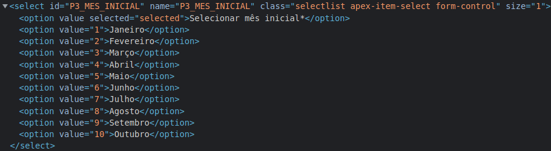
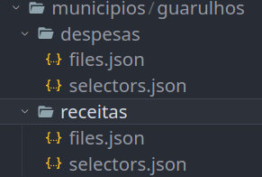
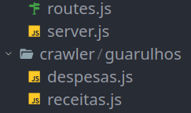

# Bem vindo ao projeto Cool Call!

## Guia de contribuição

#### Obs: Todo o processo que você irá, provavelmente já foi feito por outra pessoa, logo, basta seguir os códigos já feitos de outros municípios

- ##### A primeira coisa que você deve fazer para adicionar um município é pegar o valor dos ids e/ou classes css de cada campo utilizado no portal, como por exemplo, um seletor de mês ou uma checkbox.

 

- ##### Você deve criar um arquivo .json no frontend com todos os campos que você pegou do portal da transparência do seu município.

 

- ##### Você deve criar os controllers, rotas e chamadas do crawler do seu município.



- ##### Você deve criar a estrutura HTML/JSX do seu município no frontend


## Guia de instalação
```bash
# Para instalar as depedências do projeto
$ yarn

# Para iniciar a aplicação
$ yarn start
```
